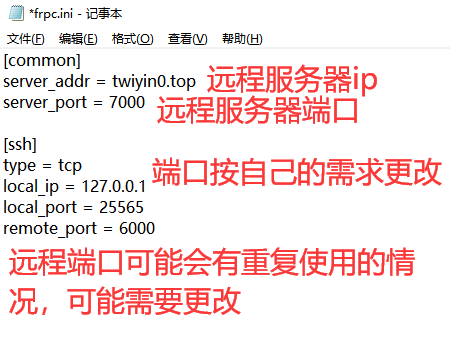
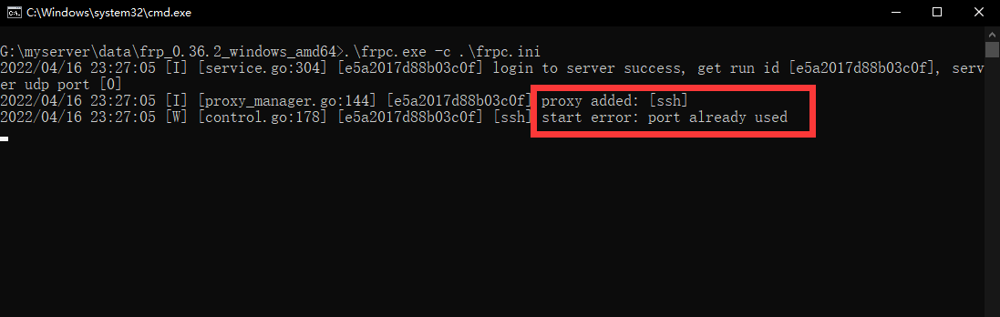

:::tip
frp 是一个专注于内网穿透的高性能的反向代理应用，支持 TCP、UDP、HTTP、HTTPS 等多种协议。可以将内网服务以安全、便捷的方式通过具有公网 IP 节点的中转暴露到公网。也是离线mc玩家联机、开服等最好的选择之一。
:::
<!--truncate-->

# Frp内网穿透服务使用教程

## 准备工作
首先我们得需要一个客户端(点击链接下载对应版本的Frp客户端)  
* [FRP客户端-win](https://twiyin0.com/files/zip/frp_win.zip)
* [FRP客户端-linux](https://twiyin0.com/files/zip/frp_linux_amd64.tar.gz)
:::tip
Linux_arm端的FRP客户端我这里就不提供了，如果你想了解更多  
请前往： [Frps.cn](https://frps.cn/11.html)  
因为Linux也同理，所以以下仅以win为例
:::

## 第一步 解压FRP
- 1、将frp_win.zip复制粘贴到一个空文件夹
- 2、使用解压软件将frp_win.zip解压
  
- 3、进入`frp_0.36.2_windows_amd64`文件夹
- 4、用记事本打开`frpc.ini`文件

- 5、按照下图配置

- 6、server_addr、server_port就按照图中一样填入，当然如果你有其他更好的服务器也可以换。type选择tcp、udp，mc开服只要tcp。local_ip和local_port按自己的需求配置。如果是开mc服务器默认是25565。remote_port是远程服务器端口，可能会有端口复用的情况。

## 第二步 启动FRP客户端服务
- 1、文件夹内空白处shift+右键，选择用powershell打开

- 2、在powershell内输入命令
```
.\frpc.exe -c .\frpc.ini
```
- 3、显示下图这样时，就表示成功了


## 优化
每次我们打开服务可能都要打开文件夹然后再打开powershell，特别麻烦  
因此，我们可以使用脚本简化我们的步骤。  
- 1、文件夹内新建一个文本文档，并且改名为start.bat

:::tip
**提示**  
关于如何修改后缀名，百度上有教程[直通车](https://jingyan.baidu.com/article/2fb0ba4076127741f2ec5ff0.html)
:::
- 2、右键`start.bat`点击编辑，复制粘贴以下代码，`ctrl+s`保存，关闭。
```
.\frpc.exe -c .\frpc.ini
pause
```
- 3、将脚本发送到桌面，右键start.bat，选择`发送到`然后`发送到桌面`

这样我们双击桌面上的start.bat就能打开我们的frp客户端了。

## 某些情况说明
### ERROR: port already used

说明远程端口被占用，可以换一个端口，即修改`frpc.ini`中的`remote_port`

### no such host

说明服务器地址可能错了

### A connection attempt failed

说明bind_port可能选错了，修改`frpc.ini`中的`server_port`，也有可能是你的网络问题。

### 其他问题
如果遇到其他这里未提及的问题可以在群里联系**音铃Twiyin0**
