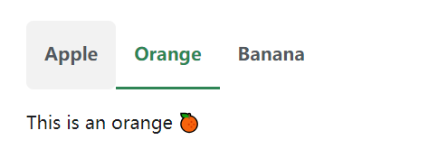

import Tabs from '@theme/Tabs';
import TabItem from '@theme/TabItem';

:::tip
为了规范文档编写，提高文档质量，特制定此文档编写规范书。  
该部分包含对标题命名、特殊符号使用等规范
:::

> 此网站所有目录下的文档都使用`markdown`编写，此规范使用于本站所有markdown(`.md`或`.mdx`文件)  

<!--truncate-->

# 文档编写规范
> 此网站所有目录下的文档都使用`markdown`编写，此规范使用于所有markdown(`.md`或`.mdx`文件)  

## 一般规范

* <span style={{ "color": "#ffae1a" }}>跳转的链接一定要确保是正确的</span>，可以使用vscode的ctrl+click跳转，看是否跳转到正确位置
* <span style={{ "color": "#ffae1a" }}>一般标题不超过四级</span>，特殊情况下可使用五级标题（如文档内需要跳转、样式无法满足要求等）
* 正文中含有特殊符号可以使用`\`转义,如果是组合可以在第一个符号前转义`\<aa>`,`\[abc]()`,`\&amp;`
* 换行使用双空格+回车或者`<br/>`,`<br>`。当然你可以使用`*`,`-`等列表的形式换行
* markdown语法遵循[Markdown 官方教程](https://markdown.com.cn/basic-syntax/)
* markdown语法速查表可查看[Markdown 语法速查表](https://markdown.com.cn/cheat-sheet.html)

## 标题规范
**标题尽量不要超过5级**
1. <span style={{ "color": "#ffae1a" }}>标题非必要情况下不要加粗</span>，如果有特殊需求（如警告、危险等强调的地方）可以使用加粗或者更改颜色
    **注:** 更换颜色的代码为  
    ```markdown
    <span style={{"color":"颜色代码"}}>文本</span>
    ```
    或者你也可以使用以下代码，但是这会导致文本字体不同于正文，不太推荐  
    ```
    $\color{#ffae1a}{文本}$
    ```
    举例: <span style={{ "color": "red" }}>危险</span> || <span style={{ "color": "#00BFFF" }}>危险</span>
    ```markdown
    <span style={{ "color": "red" }}>危险</span> || <span style={{ "color": "#00BFFF" }}>危险</span>
    ```
    或
    ```
    $\color{red}{危险}$ || $\color{#00BFFF}{危险}$ # {危险}的{}可以省略，看个人习惯
    ```

2. <span style={{ "color": "#ffae1a" }}>如果标题中含有标号（如一、二、三、四等）不方便跳转的可以使用以下代码</span>  
    #（几级都行）\{#custom-id}
    ```markdown
    ### 三、标题三 {#title-3}
    跳转时用
    [跳转到标题三](#title-3)
    ```

    不过我建议遵循以下几点
    - 使用格式为(#一级标题-二级标题-三级标题)，例如跳转到3.1.2可以这样操作  
    ```markdown
    # 三、第三个一级标题 {#3}
    ## 3.1 第三个一级标题的第二个二级标题 {#3-2}
    ### 3.1.2 第三个一级标题的第二个二级标题的第三个三级标题 {#3-2-3}

    跳转时用
    [三、第三个一级标题](#3)
    [第三个一级标题的第二个二级标题](#3-2)
    [第三个一级标题的第二个二级标题的第三个三级标题](#3-2-3)
    ```

3. 每个 Markdown 文档会在右上角显示一个目录栏。 目录默认只显示 h2 和 h3 标题。 如果需要显示多级标题，可以在md文件头部`---`内使用以下代码
```markdown
---
# 显示 h2 到 h5 标题
toc_min_heading_level: 2
toc_max_heading_level: 5
---
```

## 正文规范
- 正文需要保证格式不会出错，推荐使用vscode插件`Markdown Preview Enhanced`  
安装后ctrl+shift+v可以预览markdown文件，可以使用这个插件检查自己的正文内容是否有误
- 不同重点可以用不同颜色区分，同一个页面内不要出现太多重点，避免页面混乱

## 文件命名与图片存储位置规范
* <span style={{ "color": "#ffae1a" }}>原有的文件与文件名不可变动，避免链接损坏从而导致项目无法编译</span>
* 文档文件名不得使用中文，非必要不使用拼音，可以机翻（
* 本地图片存储位置可以在md文件所在位置新建`/img`文件夹，如果md所在位置有多份md文件则在`img`文件夹内再创建对应md文件的子文件夹，将相关为突破或媒体放入其中。图片尽量不要超过10M。目录结构如下这样可以避免引用图片时链接出错
    ```
    /(root)
    /img
    ./awa
    ../img.jpg
    ./bbb
    ../img-b.png
    awa.md
    bbb.md
    ```

## 思维导图的使用
本文档已支持mermaid语法，可以绘制思维导图，使用方法如下
```markdown
\```mermaid # 省略掉这个\,这个只是为了防止语法出错加的转义符
graph TD;
    A-->B;
    A-->C;
    B-->D;
    C-->D;
\```
```

示例效果


更多语法可参考[mermaid.js](http://mermaid.js.org/intro/syntax-reference.html)

## 选项卡使用规范
选项卡是个好东西，能把一些相似的内容放在一起节省页面空间  
  
使用方法: 
1. 在md文件前面引入以下代码, **<span style={{ "color": "#ffae1a" }}>一定要引入，不然会报错</span>**
```
import Tabs from '@theme/Tabs';
import TabItem from '@theme/TabItem';
```
2. 在需要使用选项卡的地方使用以下代码
```html
    <Tabs>
    <TabItem value="apple" label="Apple" default>
        This is an apple 🍎
    </TabItem>
    <TabItem value="orange" label="Orange">
        This is an orange 🍊
    </TabItem>
    <TabItem value="banana" label="Banana">
        This is a banana 🍌
    </TabItem>
    </Tabs>
```
3. 效果如下  

<Tabs>
<TabItem value="apple" label="Apple" default>
    This is an apple 🍎
</TabItem>
<TabItem value="orange" label="Orange">
    This is an orange 🍊
</TabItem>
<TabItem value="banana" label="Banana">
    This is a banana 🍌
</TabItem>
</Tabs> 

## 告示语法规范
除了基本markdown语法外，还可以用以下语法来制作告示  
以下由上至下重要程度依次增加  

```text
:::note 备注
这是一个备注
:::

:::tip 提示
这是一个提示
:::

:::info 信息
这是一个信息
:::

:::warning 警告
这是一个警告
:::

:::danger 危险
这是一个危险
:::
```

效果如下

:::note 备注
这是一个备注
:::

:::tip 提示
这是一个提示
:::

:::info 信息
这是一个信息
:::

:::warning 警告
这是一个警告
:::

:::danger 危险
这是一个危险
:::

## 版本号命名规范
* 版本号统一写在`/docs/notice/commit-ji-lu.md`文件内，别的地方就不要写了，影响观感
* 版本号格式为 w.x.y.z
    - w: 文档模板版本号(一般由`音铃`)更改: 文档模板项目更改后+1
    - x: 文档主题版本号(一般由`音铃`)更改: 主页或者主题更换后+1
    - y: 文档增减版本号: 每增减一个md文档则+1
    - z: 文档修改版本号: 没有新增md文档但是修改了md文件则+1
* 版本号不是必须的，建议写上，方便以后查阅
* 版本号后可附加`by.{username}`与时间
* 如果上一个修改者没有更改版本号，你可以选择跳过，也可以选择从上面的版本号上新增
