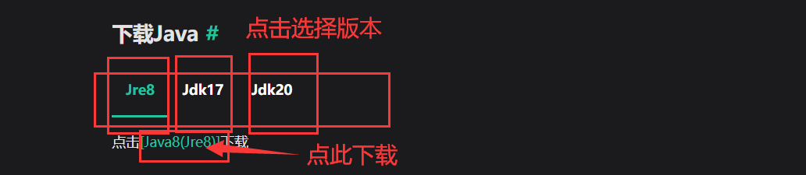

# Java安装及使用
** <span style={{color: 'red'}}>jre8/jdk8安装和jdk16安装都是一样的步骤</span> **
### 下载Java

```mdx-code-block
import Tabs from '@theme/Tabs';
import TabItem from '@theme/TabItem';

<Tabs>
  <TabItem value="jre8" label="Jre8">
    点击<a href="https://javadl.oracle.com/webapps/download/AutoDL?BundleId=248774_8c876547113c4e4aab3c868e9e0ec572" target="_blank">[Java8(Jre8)]</a>下载
  </TabItem>
  <TabItem value="jdk17" label="Jdk17" default>
    点击<a href="https://cdn.azul.com/zulu/bin/zulu17.44.15-ca-jdk17.0.8-win_x64.msi" target="_blank">[Java17(Jdk17)]</a>下载
  </TabItem>
  <TabItem value="jdk20" label="Jdk20">
    点击<a href="https://cdn.azul.com/zulu/bin/zulu20.32.11-ca-jdk20.0.2-win_x64.msi" target="_blank">[Java20(Jdk20)]</a>下载
  </TabItem>
</Tabs>
```

### 安装


选择下载



** 服务器版本是1.20.1，如果客户端用1.16及以上版本建议使用jdk17 **  
下载好了以后点击下载好的msi文件  
然后无脑下一步就行..........

### 使用

就这么用...............
