# 皮肤站帮助文档

[沃玛人皮肤站链接](https://skin.warma.ren/)  

>
手机也是一样的，跟电脑没有什么区别  
结束屏幕大小不一样罢了  
验证邮箱的时候也记得用手机打开你的邮箱
>

## 皮肤站注册

&#x20;**注意**&#x20;  

皮肤站每个邮箱一个号，每个ip两个号;  

目前仅支持使用QQ邮箱注册，使用其他邮箱会出错。

### 1.进入沃玛人皮肤站页面； 

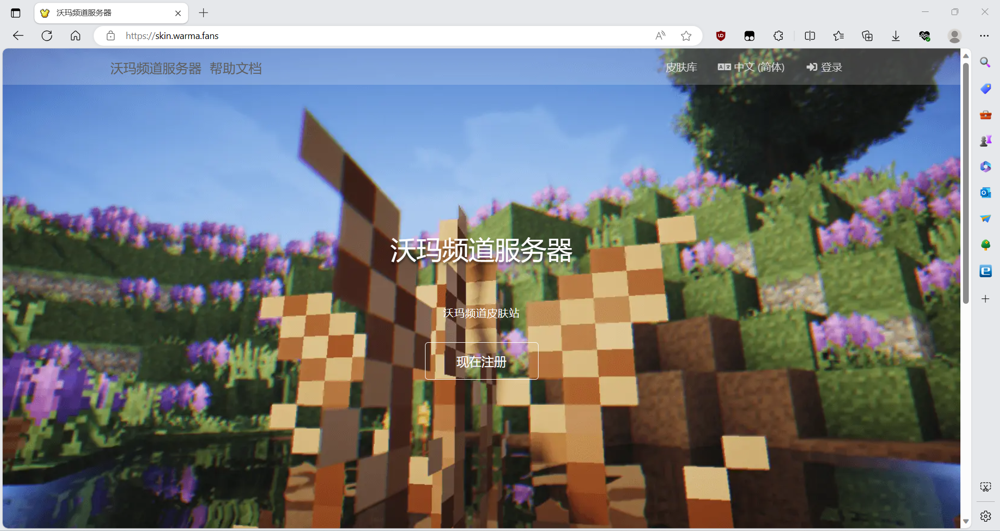

### 2.打开[皮肤站](https://skin.warma.ren)输入对应信息，点击注册：

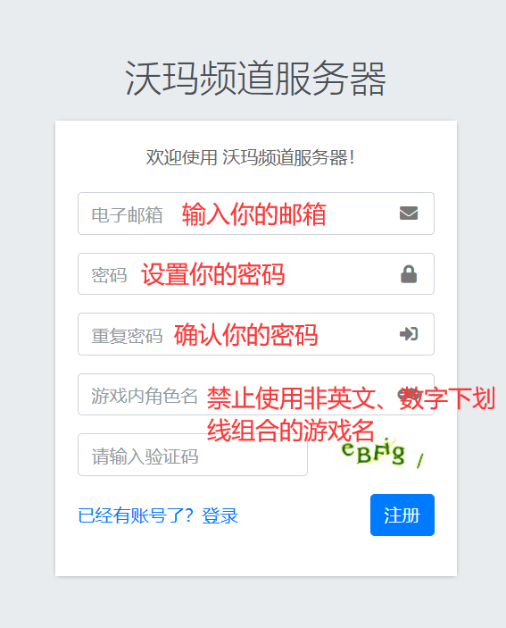  
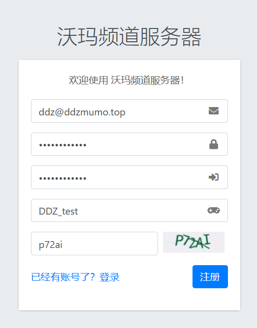  
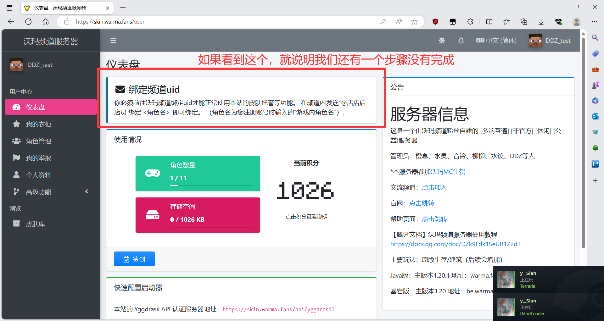  
### 3.打开[QQ邮箱](https://mail.qq.com)登入并打开收件箱  
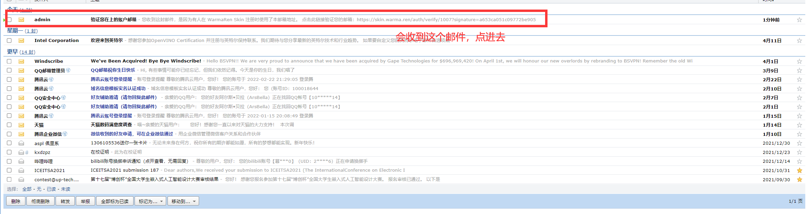  
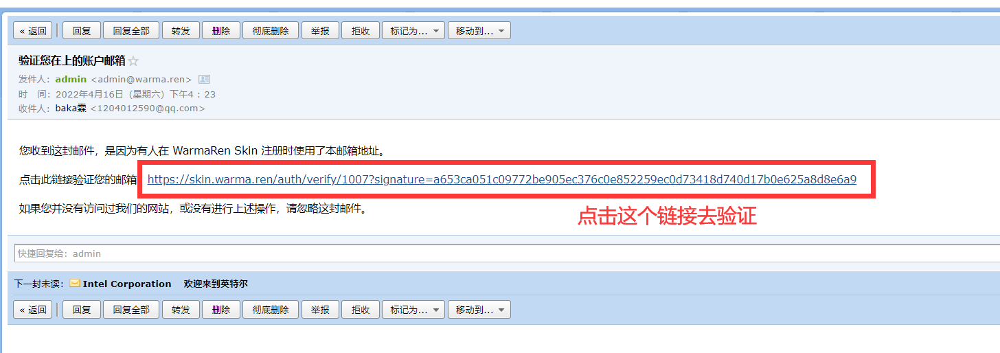  
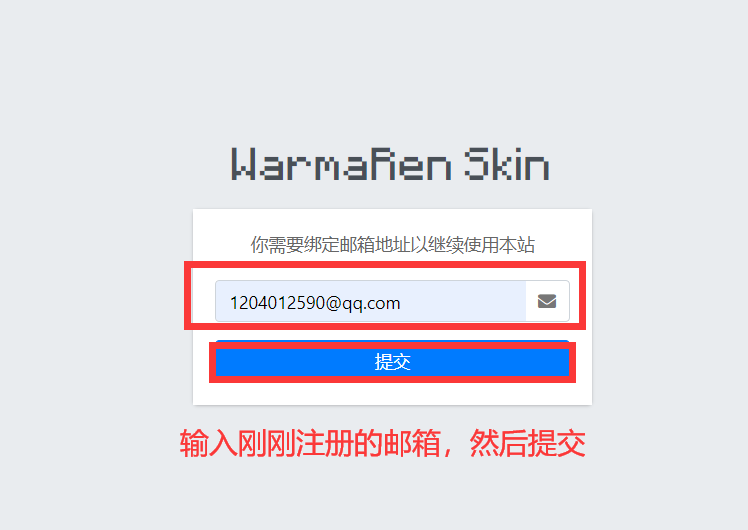  
  
  
.png)  

这个是皮肤站插件的问题，我们只能用QQ邮箱注册Mojang正版用户暂无法登录皮肤站  

**角色名不要用中文！！！！！**

**注册完成以后请打开你的邮箱收件箱查看是否有收到 沃玛人皮肤站验证 的邮箱，里面有条验证链接，点击它，输入你刚刚注册的邮箱即可。**  

>&#x20;**注意**&#x20;  

如果收件箱没有收到邮件的话，就去垃圾邮件中查看一下；  

目前仅支持QQ邮箱。  

没有收到邮件的话请联系管理员：**音铃Twiyin0，水灵Shuiling** 。
>

## 更换皮肤

在皮肤站主页左侧点击`皮肤库`；  

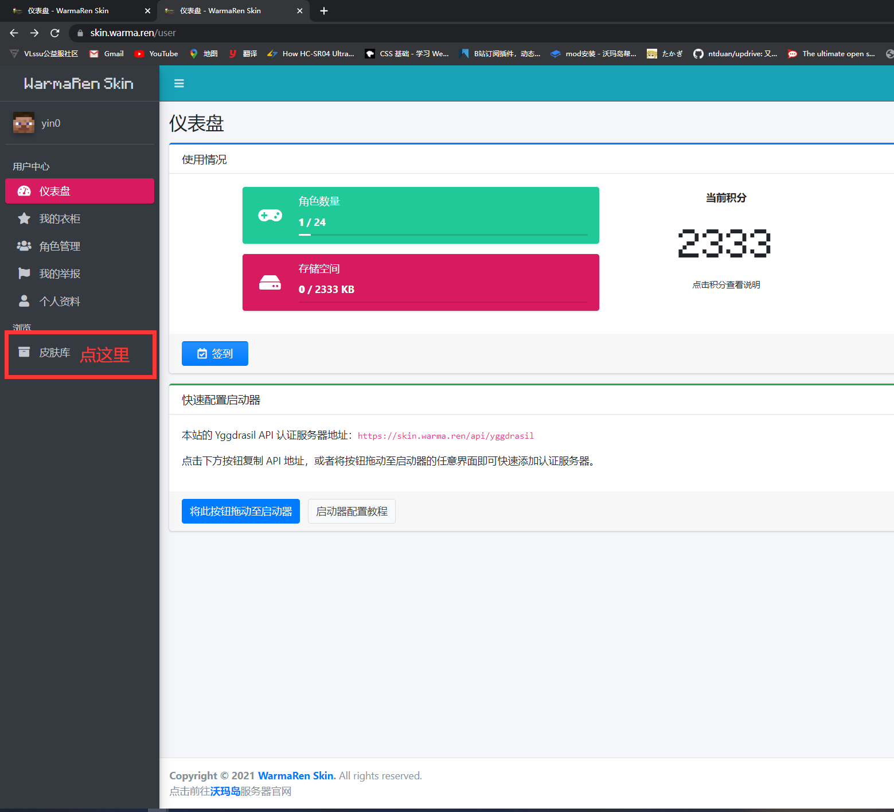 

选择你想要的皮肤，点进去；  

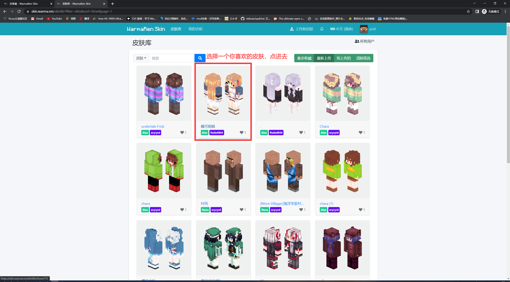 

点击`添加至衣柜`；  

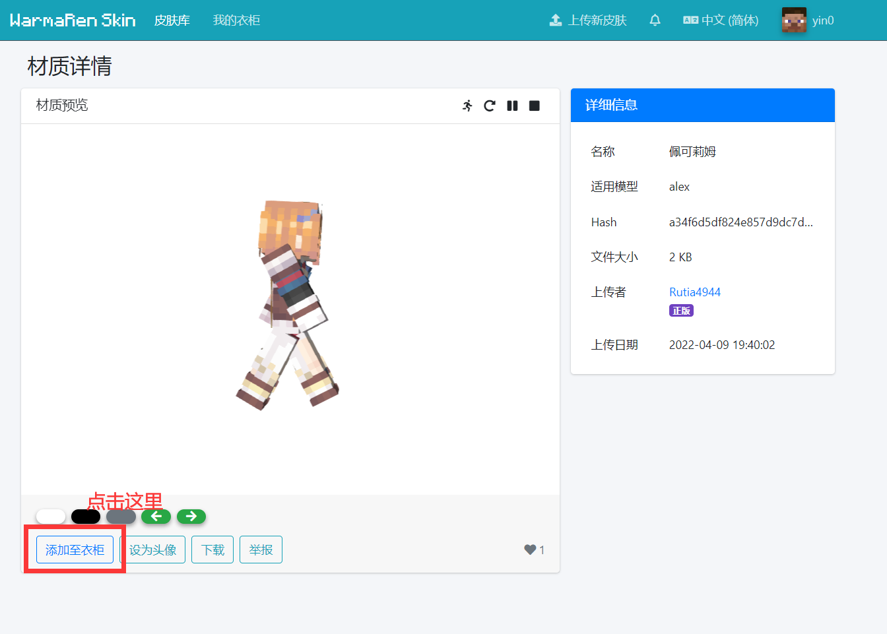 

命名随便，确认即可；然后点击`立即使用`；  

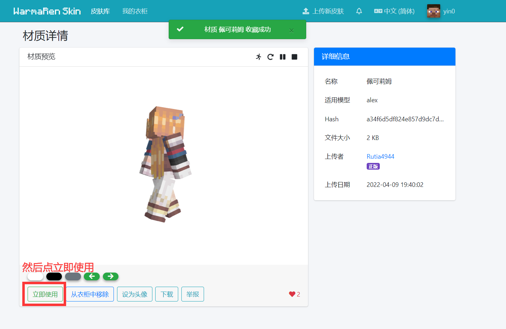 

点击你要更换的角色, 这样就成功更换皮肤了；  
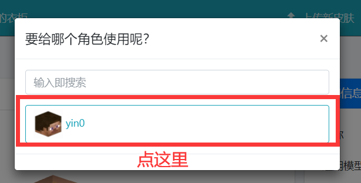 

之后可以进行下一步：  
[如何加入服务器](../../serverDocs/enterTheServer/README.md)
