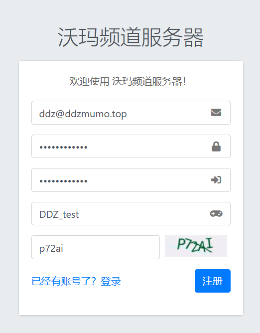
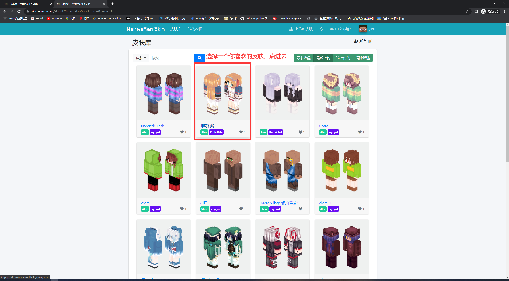

# 皮肤站帮助文档

[沃玛频道皮肤站链接](https://skin.warma.fans/)

手机也是一样的，跟电脑没有什么区别就是屏幕大小不一样罢了

## 皮肤站注册

注意

皮肤站每个频道用户一个号，每个账号仅限一个角色,每个IP限制注册三个账号;

目前支持使用主流几乎所有邮箱 例如：QQ邮箱，网易163邮箱，Gmail, 微软邮箱 等邮箱注册。

服务器现在需要使用邮箱注册皮肤站并进入频道进行认证才能成功加入服务器

请各位想玩的沃沃头注意哦！

### 1.进入沃玛频道皮肤站页面；

### 2.打开[皮肤站](https://skin.warma.fans/auth/register)输入对应信息，点击注册!

#### 记住你的【角色名】后面要用！！

### 

### 3.加入QQ群并认证

打开[QQ群入口](https://qm.qq.com/q/g5QutO8rio)加入沃玛频道服务器QQ群*（1139412612）*

### 4.绑定皮肤站id

输入 @店员 绑定 【你的角色名】

> 在这里一定要使用“**@**”，不使用“**@**”就没法绑定

稍等片刻，不出意外你将收到下面的消息

然后你就可以酣畅淋漓开始进行游戏了

> &#x20;**注意**&#x20;

**如果出现绑定失败的信息（如上图）或没有相应（店员压根没有理你），请确认你的输入是否正确，检查无误请寻求频友（管理员）帮助，之后再次绑定即可**

## 更换皮肤

在皮肤站主页左侧点击`皮肤库`；

选择你想要的皮肤，点进去；

点击`添加至衣柜`；

命名随便，确认即可；然后点击`立即使用`；

点击你要更换的角色, 这样就成功更换皮肤了；

之后可以进行下一步：
[如何加入服务器](../../serverDocs/enterTheServer/README.md)
