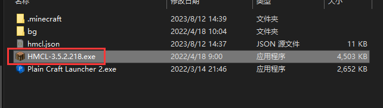
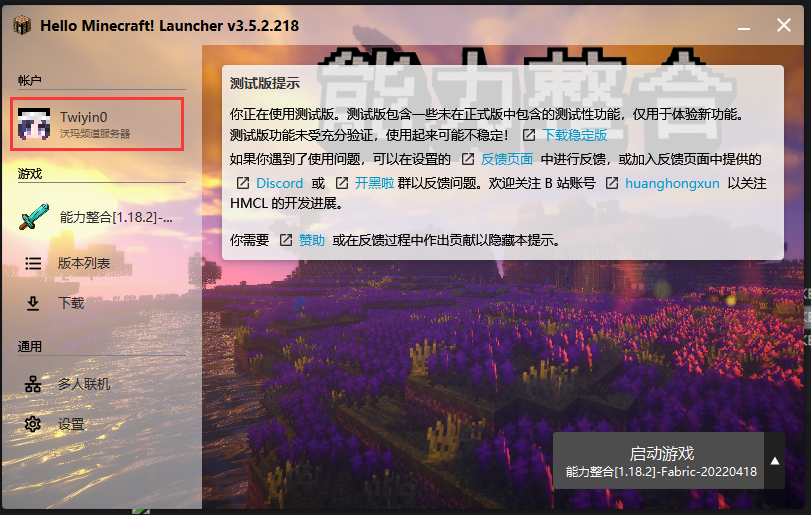
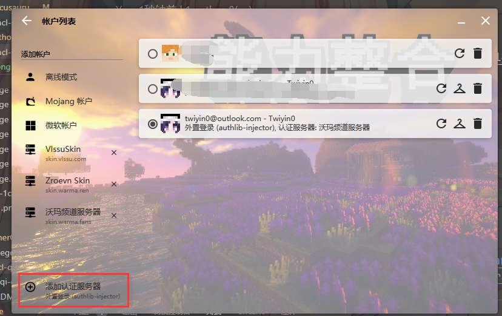
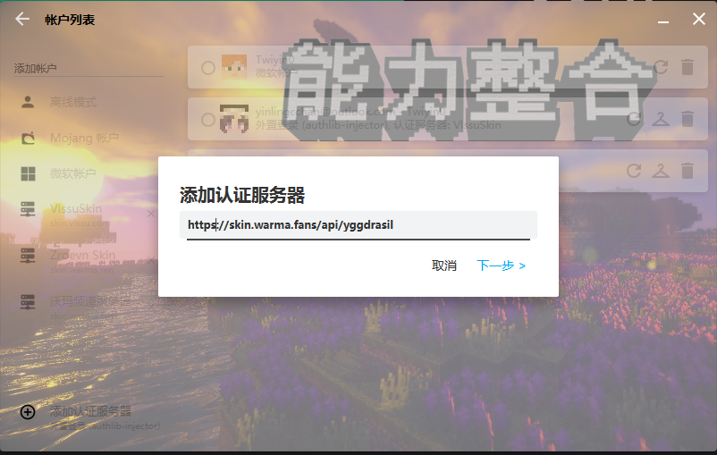
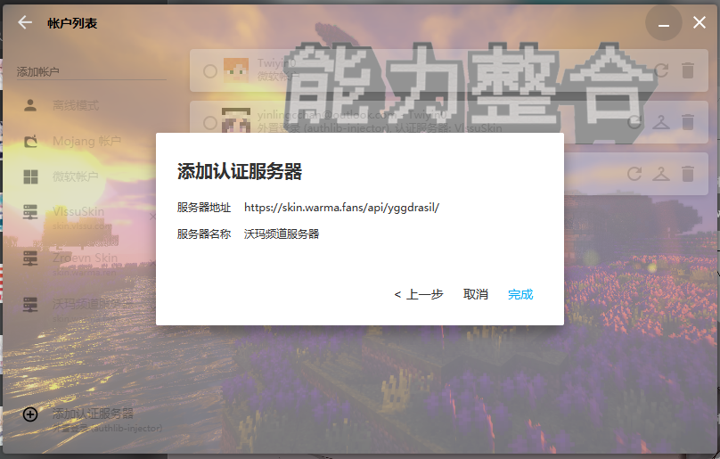
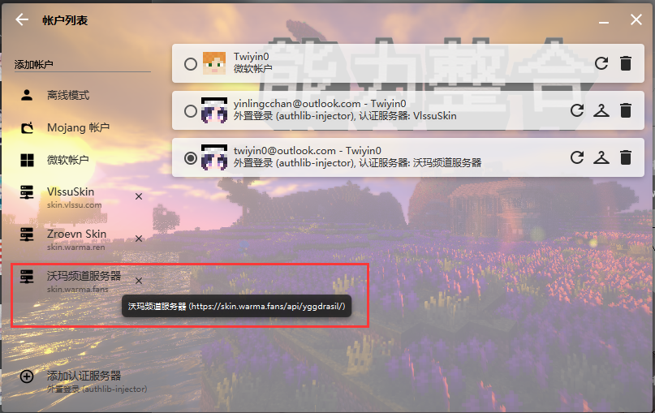
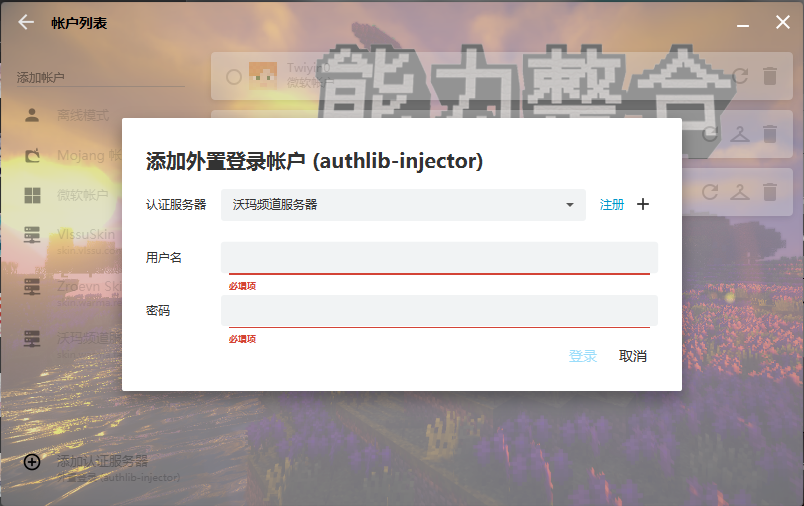

# HMCL启动器

## 前置知识

* [皮肤站帮助文档](../First/Readme/pi-fu-zhan-wen-dang)

## HMCL配置

#### 1.打开 HMCL.exe

#### 2.点击头像这位置

#### 3.点击左下角添加认证服务器

#### 4.输入皮肤站地址 [skin.warma.fans](https://skin.warma.fans) 或者认证服务器地址 [https://skin.warma.fans/api/yggdrasil](https://skin.warma.fans/api/yggdrasil)点击下一步

#### 5.点击**`完成`；**

#### 6.点击左侧沃玛频道服务器

#### 7.填写皮肤站的用户名和密码然后登录就完成了

#### 注意：

.png)

服务器名称可能会出现错误“Blessing Skin”的情况，这个没关系，服务器地址正确就行。

#### 8.完成后回到主页，点击**`开始游戏`**，皮肤站登录就完成了。
