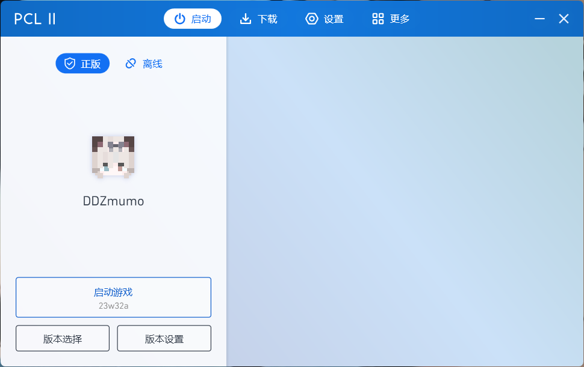
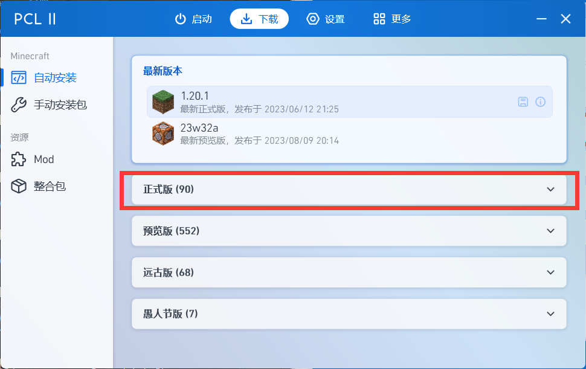

# PCL启动器
:::danger 注意
由于没有更新图片，该教程仅供参考  
请将第十步的认证服务器和注册链接中的`https://skin.warma.ren`改成`https://skin.warma.fans`  
游戏版本根据自己的需要安装
:::

## 前置知识

* [皮肤站帮助文档](../First/Readme/pi-fu-zhan-bang-zhu-wen-dang)

## PCL配置

**1.双击打开 PCL2.exe；**

**2.点击顶部的`下载`；**

**3.选择 正式版 >> 1.16.5 ；**

.png)

**4.点击后`开始安装` ；**

.png)

**(4).在右下角查看进度；**

.png)

**5.收到提示`安装成功` 后，就可以返回启动页面了；**

.png)

**6.点击`版本设置` ；**

.png)

**7.点击`设置` ；**

.png)

**8.滚轮往下划，直到看到`登录方式` 为止；**

.png)

**9.选择`第三方登录: Authlib-Injector` ；**

.png)

**10.然后按照这样来填写：**

.png)

&#x20;   仔细检查核对所填**`认证服务器`**、**`注册链接`**和**`自动进入服务器`**（选填）与图中是否一致。且字符均为**英文半角**字符。如果未填**`自动进入服务器`**一项，稍后在进入游戏时需进入多人游戏 >> 添加服务器里手动添加相应的服务器名称和地址，服务器信息详见 
[Java安装及使用](../First/Readme/java-an-zhuang-ji-shi-yong)  

&#x20;

#### 11.点击左上角 **`←`** 返回，发现我们已经登入皮肤站。点击**`启动游戏`**即可。

.png)

