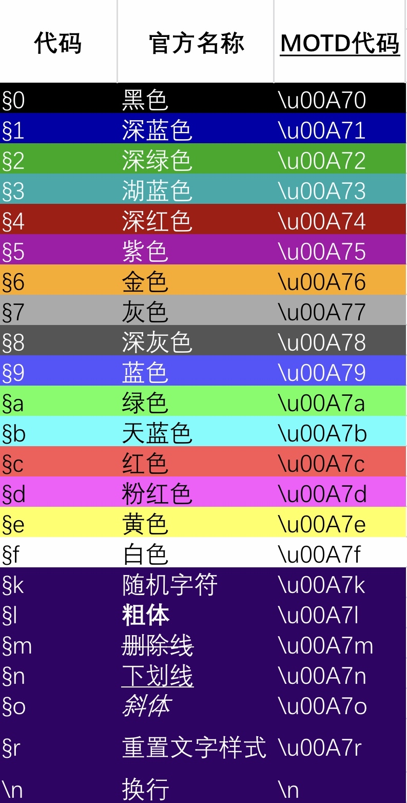

# 服务器常用命令列表

## 指令列表

| 指令                     | 参数                                   | 说明           |
| ----------------------- | ------------------------------------- | ------------ |
| /afk                    | 无                                     | 挂个机吧   |
| /back                   | 无                                     | 回到上一地点   |
| /balance                | 无                                     | 看看钱包(没开) |
| /baltop                 | 无                                     | 看看钱包排行榜(没开) |
| /baltop                 | 无                                     | 看看钱包排行榜(没开) |
| /co i                   | 无                                     | 开启方块检查模式 |
| /co lookup              | (r:半径,t:时间),u:用户,action:行为等      | 查看周围方块变化 |
| /dback                  | 无                                     | 回到上次死亡地点 |
| /fly                    | 无                                     | 飞行，但是你们用不了(欸嘿) |
| /flyspeed               | 整数                             | 设置飞行速度，你们还是用不了(欸嘿) |
| /hat                    | 无                                       | 手上的东西戴在头上 |
| /home                   | 家名                                     | 回家喽 |
| /homes                  | 无                                      | 看看你家 |
| /list                   | 无                                     | 查看服务器在线的人 |
| /me                     | 消息                            | 全体目光向我看齐，我宣布个事 |
| /msg                    | 某人+空格+消息                       | 悄悄告诉某人消息 |
| /nick                   | 昵称                            | 改名(支持[&+一位十六进制颜色]) |
| /pay                    | 某人+数字                          | 给某人一些钱钱(没开) |
| /ping                   | 无/(玩家)                              | 查看自己/别人的延迟 |
| /playtime               | 无                                  | 查看自己游戏时长 |
| /playtimetop            | 无                                  | 查看全服游戏时长排行榜 |
| /realname               | 玩家                              | 查看玩家的真实名字 |
| /removehome             | 家名                            | 移除家 |
| /removewarp             | 地标名                            | 移除地标 |
| /ride                   | 无                                 | 骑面对的实体 |
| /se                     | 行数+内容                           | 修改告示牌n=(1,2,3,4)行的内容 |
| /server                 | 服务器名称                           | 传送到别的子服务器 |
| /sethome                | 家名                               | 设置名为xxx的家(最多设置20个)  | 
| /setwarp                | 地标名                               | 设置名为xxx的地标(最多设置20个)  |
| /shakeitoff             | 无                              | 从老子脑壳上滚下来(把骑在头上的人甩下来) |
| /sit                    | 无                              | 席地而坐 |
| /skin                   | 玩家、地址                          | 设置皮肤（基岩版用） |
| /spawn                  | 无                              | 回城 |
| /suicide                | 无                              | 紫砂了 |
| /tpa                    | 玩家                             | tp 某个玩家 |
| /tpaccept               | 无/玩家                             | 同意(某个)玩家的tp |
| /tpdeny                 | 无/玩家                             | 拒绝(某个)玩家的tp |
| /tpahere                | 玩家                               | 请求玩家tp到自己这里 |
| /tps                    | 无                                 | 看服务器卡不卡(tps越低越卡，最高20) |
| /warp                   | 地标                               | 传送到地标 |
| /warp showlist          | 地标                               | 查看所有地标 |

## 个别指令说明
### /co lookup
这个指令可以查看周围方块的变化  
举例： /co l r:5 t:1d  
查看以自己为中心，5个方块为半径区域内，1天之中的方块变化  
可查看[co 使用说明](../Other/pluginsDocs/co-cha-jian-zhi-ling-shuo-ming)  
更多详情可以去看维基百科[wiki-coreprotect](https://mineplugin.org/CoreProtect)  

### cmi插件百科[cmi插件指令](../Other/pluginsDocs/cmi-cha-jian-bang-zhu)
### /nick_以及颜色代码帮助
这个指令可以用来修改你在服务器里的昵称
可以参考下面的颜色代码表  
"§"为原版分节符，**我们需要使用"&"来代替它**  
**使用例：**  
/nick &6cxchency  
可将自己的名字改为cxchency  
并且发言均为金色  
/nick &6cxchency&r  
名字同上，但是发言样式为默认样式（既发言字体仍为白色）  
**颜色代码表**：
  

### /server

~~现在不好使了~~  
因为很多老周目地图没开  
/server &lt;子服名称&gt;    传送到其他子服
子服列表  

| 子服名称                 | 说明                                  |
| ----------------------- | ------------------------------------- |
| run                     | 跑酷服                                 |
| rpg                     | 空岛服                                 |
| magic_battleground      | 魔法战地服                              |
| s1~7                    | 过往周目生存服                          |
| huayue                  | 花月城                                 |
| iin0                    | 创造服（铃乡乐园）                       |
| wp                      | 沃频服（主服）                          |  

命令示例  
/server iin0     传送到创造服  
~~现在不好使了~~
