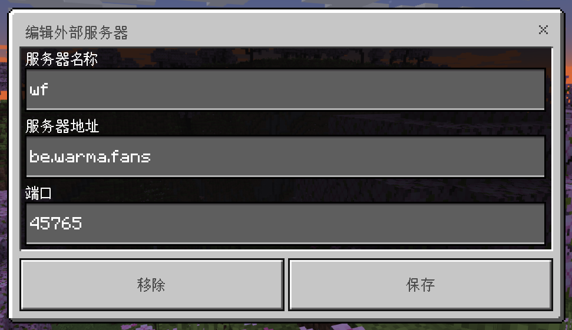
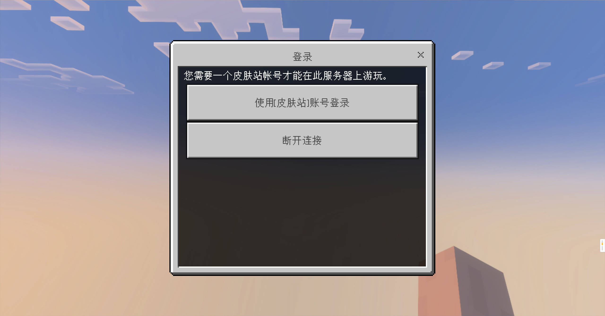

# 基岩版加入服务器

## 前置知识

[皮肤站帮助文档](../../First/Readme/pi-fu-zhan-wen-dang)

## 服务器信息

版本（基岩版）：1.20.10~1.20.41.02(正式版)

> beta(测试)版可能会导致服务器连接失败

服务器名称：**沃玛频道服务器** `其实可以随便填`

服务器 ip：

**be.warma.fans** (注意是英文的句号)

服务器端口：

**45765**

版本号在主页面看：

.png>)

安装文件的话，请自行寻找，在 mc 子频道的角落里应该会有，但请不要传播！这很重要！！！

## 流程

手机版（基岩版）加入服务器流程：

- 1.注册皮肤站
- 2.进入频道在任意子频道
- 3.发送@店店店店员 绑定 你的游戏 id  
  **注意！请先进行频道内的认证成为一名认证沃沃头才能发言哦！**  
  **相关教程在[这里](../../First/Readme/pi-fu-zhan-wen-dang)**
- 4.打开游戏；
- 5.使用微软账户登入主界面；
- 6.添加并进入服务器；
- 7.选择 mojang 账户登录(你需要的是皮肤站账号,并非官方 mojang 账号或微软账户)
- 8.输入皮肤站邮箱及密码并登录；
- 9.完成。

**注意**

基岩版（手机版）用户不需要启动器，因此，不用管什么启动参数，你只需要遵循接下来所述的步骤按部就班去做就行；

不要去多想，有问题就问，里面的步骤可能你想破脑子都想不出来为什么要这么做（比如为何要点使用 Mojang 账户登录而不用微软账户，按步骤里做就行）。

## 加入服务器

基岩版（安卓手机版）注册完皮肤站以后就什么都不用管了，也无需什么启动器，直接下载安装好游戏，启动就行。

#### 1.打开游戏，点击左下角的**`登录`**；

使用微软账号登录（不懂的可以百度，没有的可以注册，有的话这个步骤这里就省了）；

直连官方文档 [如何创建微软账户](https://support.microsoft.com/zh-cn/account-billing/%E5%A6%82%E4%BD%95%E5%88%9B%E5%BB%BA%E6%96%B0%E7%9A%84-microsoft-%E5%B8%90%E6%88%B7-a84675c3-3e9e-17cf-2911-3d56b15c0aaf) 。

#### 2.点击游戏 >> 服务器 >> 添加服务器（左下角）；

#### 填入图中所示信息；

#### 3.进入后点击**`使用Mojang账户登录`**，并依次输入你在 [沃玛频道皮肤站](https://skin.warma.fans) 注册的邮箱和相应的密码。点击**`登录`**即可进入服务器。

**如果出现问题：**

请移步[进不去服务器怎么办](../../Q&A/jin-bu-qu-de-yuan-yin.md)

## 更换皮肤

[皮肤站文档](../../First/Readme/pi-fu-zhan-wen-dang)
